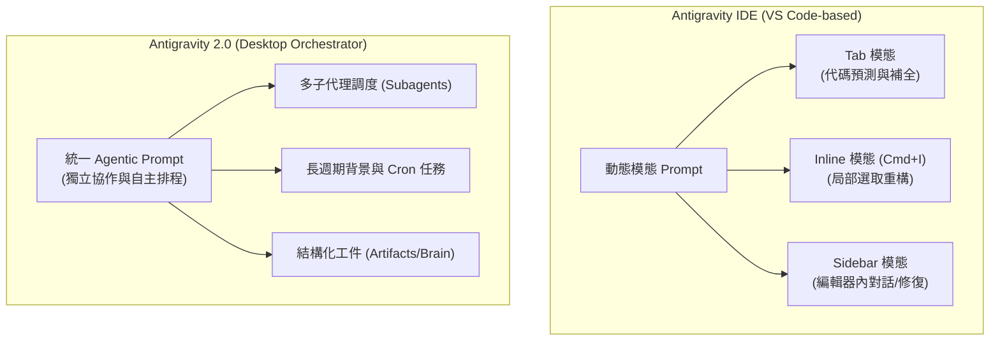
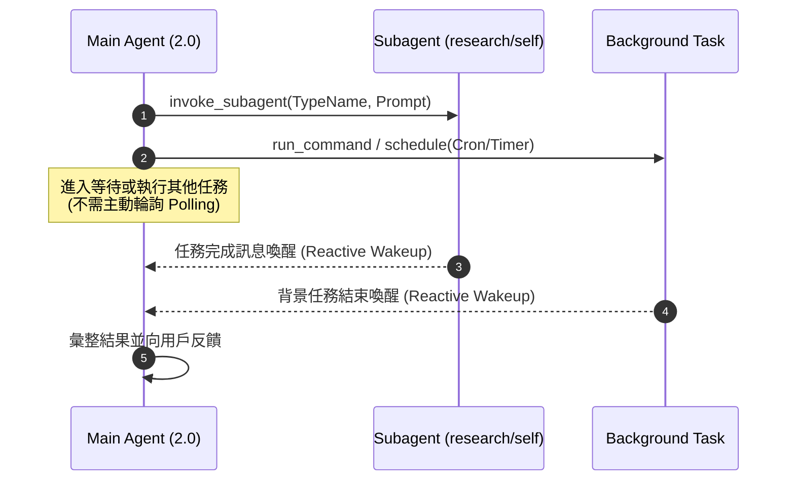

# Antigravity 2.0 與 Antigravity IDE 的 System Prompt 差異分析

本報告深入探討 **Antigravity 2.0（獨立 Desktop 應用程式）** 與 **Antigravity IDE（基於 VS Code 的整合開發環境）** 在 **System Prompt（系統提示詞）** 設計理念、架構模組與運行機制上的核心差異。

---

## 1. 核心定位與設計理念

> [!NOTE]
> 雖然兩者共用相同的底層模型（如 Gemini 系列）與基礎 Agentic 原語，但因為載體與互動場景的本質區別，System Prompt 的組裝邏輯有著根本性的劃分。



| 維度 | Antigravity IDE | Antigravity 2.0 (Desktop) |
| :--- | :--- | :--- |
| **載體形式** | VS Code 擴充/整合環境 | 獨立的 Electron 桌面應用程式 |
| **互動模態 (Modalities)** | 依動作切換三種獨立 Prompt（Tab / Inline / Sidebar） | 統一完整的 Chat Canvas & Task Orchestrator Prompt |
| **上下文焦點** | 即時游標位置、選取區域、開啟分頁、Linter 診斷 | 全局工作區管理、跨專案切換、自主背景執行 |
| **執行週期** | 短週期、即時反饋、就地編輯 | 長週期、多步驟規劃、非同步代理協作 |

---

## 2. System Prompt 各模組詳細比較

### A. 身份定義與角色邊界 (`<identity>`)

* **Antigravity IDE**：
  * **Tab / Supercomplete 模態**：Prompt 極度精簡，定義為「代碼接續引擎」，嚴格限制「不輸出自然語言解釋、僅輸出代碼補全/Diff、嚴格保持縮排與前後語意」。
  * **Inline 模態 (`Cmd+I` / `Ctrl+I`)**：限制編輯範圍為「僅針對選取的程式碼區塊進行變更」，指令著重於重構、單元測試生成或補上文檔。
  * **Sidebar 模態**：定位為「編輯器內的 Pair Programmer」，著重於針對當前檔案與 Problems 面板的修復引導。
* **Antigravity 2.0**：
  * 定義為完整的「自主 AI 軟體工程師與 Agent 編排中心」。
  * Prompt 明確賦予高自主權，包含多步驟規劃、命令列調度、瀏覽器自動化以及發起平行子代理的能力。

---

### B. 上下文注入 (`<user_information>` 與環境變數)

* **Antigravity IDE 的 Prompt 上下文**：
  * **活躍文件與游標**：動態帶入 `active_file_path`、`cursor_position`（行與列）、`selection_range`。
  * **診斷面板 (Problems)**：自動抓取當前文件或工作區的編譯錯誤（Compiler Errors）與 Lint 警告。
  * **分頁與最近檔案**：包含目前已開啟的分頁清單（Open Tabs）與剪貼簿內容（可選）。
* **Antigravity 2.0 的 Prompt 上下文**：
  * **工作區與儲存根目錄**：提供 `OS version`、`App Data Directory`、`Conversation ID`、專屬的 `Artifact Directory Path`。
  * **臨時腳本隔離原則**：明確規範臨時測試腳本必須存放在 `<appDataDir>\brain\<id>\scratch\`，嚴格禁止污染專案根目錄、系統桌面或暫存區。

---

### C. 子代理與異步調度協議 (`<subagents>`, `<messaging>`)

Antigravity 2.0 具有完整的 Agent 互通與喚醒架構，這些指令在 IDE 的輕量補全中完全不存在：



* **子代理調度工具**：提供 `invoke_subagent`、`define_subagent`、`send_message`、`manage_subagents`，支援派發唯讀的研究型子代理（`research`）或完整能力子代理（`self`）。
* **反應式喚醒機制 (Reactive Wakeup)**：Prompt 明確要求 Agent **嚴禁輪詢（No-polling）**。當後台命令或子代理完成時，系統會自動恢復模型執行，以節省 Token 與計算資源。

---

### D. 結構化工件規範 (`<artifacts>`)

Antigravity 2.0 專屬的輸出規範，強制要求將大型報告、架構設計與任務狀態寫入獨立工件：

1. **GitHub 風格警示框**：必須規範使用 `> [!NOTE]`, `> [!TIP]`, `> [!IMPORTANT]`, `> [!WARNING]`, `> [!CAUTION]`。
2. **Mermaid 限制**：嚴格限制支援的圖表類型（如 `flowchart`, `sequenceDiagram`, `stateDiagram`, `classDiagram`, `erDiagram`），禁止使用不支援的甘特圖或時間線語法。
3. **Markdown 輪播語法**：支援四反引號的 ````carousel 投影片比較語法。
4. **可點擊連結規範**：強制要求檔案連結使用標準的 `file://` scheme（如 `[main.py](file:///path/to/main.py)`）。

---

### E. 斜線指令（Slash Commands）引導差異

| 指令 | Antigravity IDE 典型指令 | Antigravity 2.0 典型指令 |
| :--- | :--- | :--- |
| **代碼修復** | `/fix`、`/refactor` | 內建於一般對話或診斷修復 |
| **目標與長時間運行** | 無 | `/goal`（持續執行直至目標達成） |
| **定時與排程** | 無 | `/schedule`（設定 Cron 或一次性計時器） |
| **深思與規劃** | `/explain` | `/plan`、`/boost`、`/grill-me`（互動訪談確認架構） |
| **多 Agent 協作** | 無 | `/teamwork-preview`（多代理協同分工） |

---

## 3. 總結對比表

| 特性項目 | Antigravity IDE | Antigravity 2.0 |
| :--- | :--- | :--- |
| **Prompt 規模** | 輕量、模態分流（根據觸發時機動態替換） | 全功能、包含完整的代理協議與系統指令 |
| **編輯器整合度** | 極高（直接操控編輯器游標、裝飾器、Diff Overlays） | 中等（專注於專案層級檔案讀寫與命令列調度） |
| **多 Agent 支援** | 僅單一 Agent 對話 | 支援多層級、多種類型的子代理調度 |
| **工件與報告管理** | 編輯器內行內預覽 / 檔案修改 | 獨立的 `<appDataDir>\brain\<id>` 工件中心 |
| **適用場景** | 日常編碼、即時補全、檔案內部重構、編譯除錯 | 大型功能開發、長時間自動化任務、架構規劃、專案遷移 |
